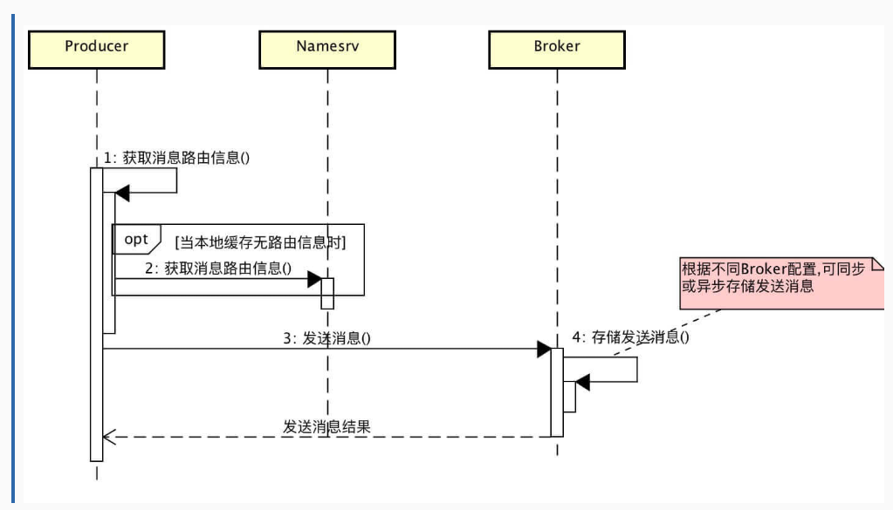

### RocketMQ消息发送形式

RocketMQ支持3种消息发送形式: 同步(sync), 异步(async), 单向(oneway)

- 同步: 发送者向MQ执行发送消息API, 同步等待, 直到消息服务器返回发送结果
- 异步: 发送者向MQ执行发送消息API, 指定消息发送成功后的回调函数, 调用消息发送API后,
  立即返回, 消息发送者线程不阻塞, 直到运行结束,
  消息发送成功或失败的回调任务在一个新的线程中执行
- 单向: 消息发送者向MQ执行发送消息API, 直接返回, 不等消息服务器的结果,
  也不注册回调函数, 就是只管发消息
---

### RocketMQ消息形式

- `org.apache.rocketmq.common.message.Message` RocketMQ消息封装类  
  主要包括topic, 扩展属性(包含tag, keys, waitStoreMsgOk等信息), 消息体等几个属性

---
### 生产者启动流程

`org.apache.rocketmq.client.producer.DefaultMQProducer` 默认消息生成者实现类

##### 1.  消息生产者启动流程

- `org.apache.rocketmq.client.impl.producer.DefaultMQProducerImpl.start(boolean)`
  启动入口

##### 2. 消息发送基本流程
消息发送基本流程: 验证消息 -> 查找路由 -> 消息发送(包含异常处理机制)

- `org.apache.rocketmq.client.producer.DefaultMQProducer.send(org.apache.rocketmq.common.message.Message)`
  消息发送入口

1. 消息验证

主要验证消息体的主题名称, 消息体判空, 消息长度限制等

2. 查找主题路由信息

获取主题的路由信息, 只有获取了这些信息才知道消息要发送到具体的Broker节点

##### 总结
- 消息生产者启动流程
> 重点理解MQClientInstance, 消息生产者之间的关系

- 消息队列负载机制
> 消息生产者在发送消息时, 如果本地路由表中未缓存topic的路由信息,
> 向NameServer发送获取路由信息请求, 更新本地路由信息表,
> 并且消息生产者每隔30s从NameServer更新路由表

- 消息发送异常机制 高可用机制保障
>- 重试
> - Broker规避, 如果在一次发送过程中发送错误, 则在某一段时间内,
>   消息生产者不会选择该Broker上的消息队列, 提高发送消息的成功率

