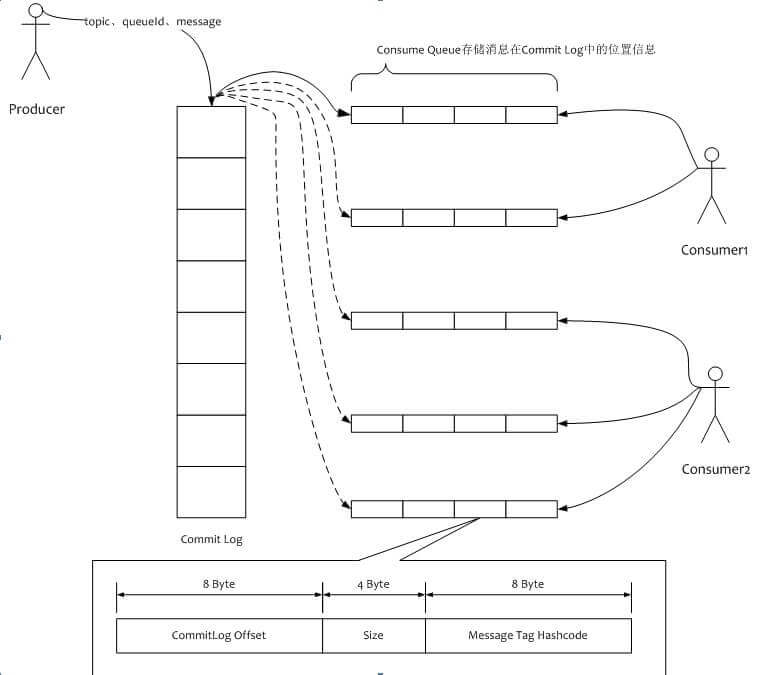

## 消息消费概述

消费组的消费模式
- 集群模式: 主题下的同一条消息只允许被其中一个消费者消费
- 广播模式: 主题下的同一条消息将被集群内的所有消费者消费一次


消息消费逻辑



消息消费顺序图  


## 消费者启动流程

`org.apache.rocketmq.client.impl.consumer.DefaultMQPushConsumerImpl#start
`

`org.apache.rocketmq.client.impl.consumer.DefaultMQPushConsumerImpl.copySubscription`
```java
 private void copySubscription() throws MQClientException {
        try {
            Map<String, String> sub = this.defaultMQPushConsumer.getSubscription();
            if (sub != null) {
                for (final Map.Entry<String, String> entry : sub.entrySet()) {
                    final String topic = entry.getKey();
                    final String subString = entry.getValue();
                    SubscriptionData subscriptionData = FilterAPI.buildSubscriptionData(this.defaultMQPushConsumer.getConsumerGroup(),
                        topic, subString);
                    this.rebalanceImpl.getSubscriptionInner().put(topic, subscriptionData);
                }
            }

            if (null == this.messageListenerInner) {
                this.messageListenerInner = this.defaultMQPushConsumer.getMessageListener();
            }

            switch (this.defaultMQPushConsumer.getMessageModel()) {
                case BROADCASTING:
                    break;
                case CLUSTERING:
                    final String retryTopic = MixAll.getRetryTopic(this.defaultMQPushConsumer.getConsumerGroup());
                    // 构建主题定于信息SubscriptionData并加入到RebalanceImpl订阅消息中
                    SubscriptionData subscriptionData = FilterAPI.buildSubscriptionData(this.defaultMQPushConsumer.getConsumerGroup(),
                        retryTopic, SubscriptionData.SUB_ALL);
                    this.rebalanceImpl.getSubscriptionInner().put(retryTopic, subscriptionData);
                    break;
                default:
                    break;
            }
        } catch (Exception e) {
            throw new MQClientException("subscription exception", e);
        }
    }
```
第一步:
同构构建主题订阅信息SubscriptionData并加入到RebalanceImpl的订阅消息中订阅关系来源主要:
- 通过调用`org.apache.rocketmq.client.consumer.DefaultMQPushConsumer#subscribe(String
  topic, String subExpression)`
- 订阅重试消息, 消费者在启动的时候会自动订阅该主题, 参与该主题的消息队列负载

第二步: 初始化MQClientInstance, RebalanceImple等

第三步: 初始化消息进度. 如果消息消费是集群模式,
那么消息进度保存在Broker上;如果是广播模式, 那么消息消费进度存储在消费端

第四步: 根据是否是顺序消费, 创建消费端消费线程服务.
ConsumeMessageService主要负责消息消费, 内部维护一个线程池

第五步: 向MQClientInstance注册消费者, 并启动MQClientInstance,
在一个JVM中的所有消费者, 生产者持有一个MQClientInstance,
MQClientInstance只会启动一次


## 消息拉取

在集群模式下, 同一个消费组内有多个消息消费者, 同一个主题存在多个消费队列,
那么消费者如何进行消息队列负载呢, 从上下文的启动流程,
得知每一个消费组内维护一个线程池来消费消息

消息队列负载, 一个消息队列在同一时间内置允许被一个消息消费者消费,
一个消息消费者可以同时消费多个消息队列, RocketMQ是如何实现?


